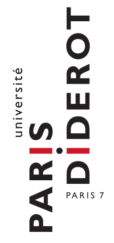
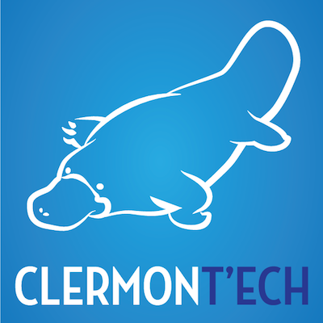

    <h3>Round Table</h3>
    <h2>Scientific (Big) Data</h2>
    <h4>challenges, sharing and ethics</h4>

    <h6 class="author">
      <a href="#">Pascal Poncelet</a>,
      <a href="http://julien.maupetit.me">Julien Maupetit</a>,
      <a href="https://tailordev.fr">TailorDev</a>
    </h6>
    

----

### Disclaimer

I am an Open Science advocate.

----

## Outline

1. What is your data management plan?
2. To whom belongs your research data?
3. Why opening research data matters?
4. What are the main barriers to openness?

----

## `$ whoami`
---

---

---

---

---

> Our mission is to develop modern tools to ease scientific work and promote Open
> Data, Open Science and Open Source in research entities.

---

### The Open Science Company Manifesto

[http://manifesto.tailordev.fr](http://manifesto.tailordev.fr)

----

## Open Science?

---

### A definition

> Open science is the movement to make scientific research, data and
dissemination accessible to all levels of an inquiring society, amateur or
professional.

<small>Source: [Wikipedia](https://en.wikipedia.org/wiki/Open_science)</small>

---

### Another definition

> Open Science describes the on-going transitions in the way research is
performed, researchers collaborate, knowledge is shared, and science is
organised. [...] facilitating more transparency, openness, networking,
collaboration, and refocuses science from a 'publish or perish' perspective to a
knowledge-sharing perspective.

<small>Source: [European Commission Blog](https://ec.europa.eu/commission/2014-2019/moedas/blog/opening-era-innovation_en)</small>

---

<small>Source: [Wikimedia commons](https://commons.wikimedia.org/wiki/File:Open_Science_-_Prinzipien.png)</small>

----

## Data Persistency

### What is your data management plan?

----

## Intellectual Property

### To whom belongs your research data?

----

## Scientific Open Data

### Why opening research data matters?

---

### Reproducibility

> Data not available. Study cannot be reproduced.

<small>Source: [Ingo Rohlfing's blog](https://ingorohlfing.wordpress.com/2015/06/18/two-proposals-for-incentivizing-data-archiving/)</small>

---

### Publishing is not enough

> On estime que les publications permettent d’accéder à environ 10 % de
celles-ci, le reste restant disponible mais non utilisé sur les disques durs
d’ordinateurs. Dans certaines disciplines, des résultats valables et importants
restent non publiés et beaucoup de données sont sous-utilisées ou perdues (c’est
en particulier le cas des données issues de résultats négatifs qui sont
oubliées).

<small>Source: Les enjeux éthiques du partage des données scientifiques • Avis
du COMETS (7 mai 2015)</small>

---

### Gateway to innovation

> Research data should go far beyond Academia.

---

### Citizen scientists

> If scientists want to monitor the effects of climate change on local
> ecosystems, for example, they can now use citizen reporting or data from
> smartphones.

<small>Source: [Open innovation, open science, open to the world, 2016](http://bookshop.europa.eu/en/open-innovation-open-science-open-to-the-world-pbKI0416263/;pgid=GSPefJMEtXBSR0dT6jbGakZD00007loyvfoz;sid=hswoNk2foSMochX7QvW2kS-6y682RAD8mL4=?CatalogCategoryID=Gj0KABst5F4AAAEjsZAY4e5L)</small>

----

## Closed Research

### What are the main barriers to openness?

----

## Thank you ♥️

[github.com/jmaupetit](https://github.com/jmaupetit/Scientific-Big-Data-challenges-sharing-and-ethics)
